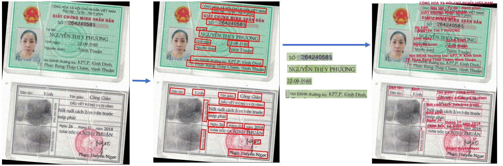
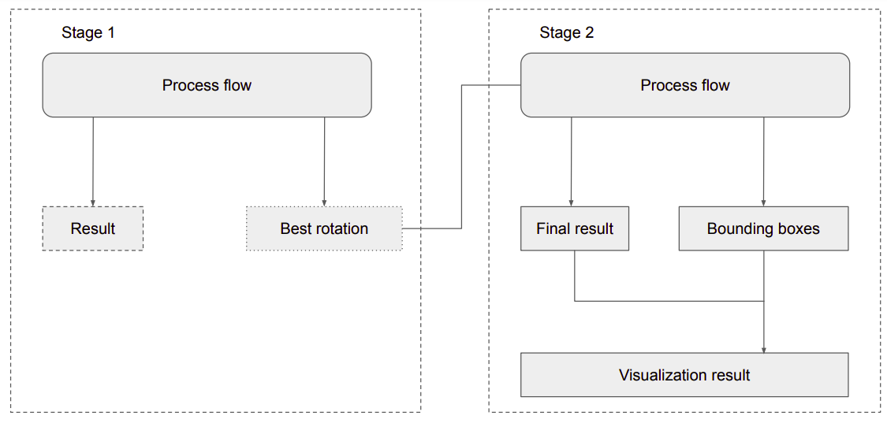
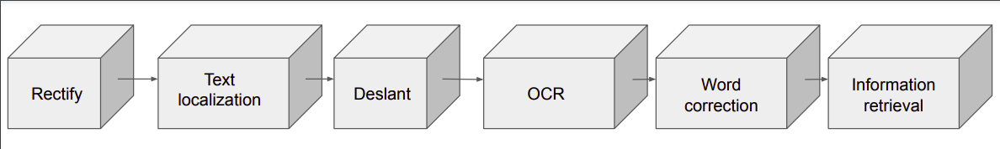

# **An OCR Toolbox for Vietnamese Documents**
<p align="left">
 <a href=""></a>
</p>

[](https://www.codefactor.io/repository/github/kaylode/vnm-ocr-toolbox)

This toolbox provides a pipeline to do OCR in Vietnamese documents (such as receipts, personal id, licenses,...). 
The project also support flexibility for adaptation.

:bookmark_tabs: More infomation:
- Report: [link](https://github.com/kaylode/vnm-ocr-toolbox/blob/master/demo/report.pdf)
- Youtube: [](https://www.youtube.com/watch?v=DZ6tY0ICXlw)

-------------------------------------------------------------
<div align="center"> Invoice (from SROIE19 dataset)</div>


<div align="center">Personal ID (image from internet)</div>



**Pipeline in detail:**
1. Use Canny Edge Detector and then detect contours.
2. Extract receipt from image and normalize.
3. Use Pixel Agreation Network (PAN) to detect text regions from extracted receipt, then crop these regions.
4. Use VietOCR to extract texts from regions, then perform word correction.
5. Retrieve information

## **Notebooks**
- Notebook for training PAN: [](https://colab.research.google.com/github/kaylode/vnm-ocr-toolbox/blob/master/demo/notebooks/[vnm_ocr_toolbox]_Train_PAN_for_Text_Detection.ipynb)

- Notebook for training Transformer OCR: [](https://colab.research.google.com/github/kaylode/vnm-ocr-toolbox/blob/master/demo/notebooks/[vnm_ocr_toolbox]_Train_OCR.ipynb)

- Notebook for training PhoBERT: [](https://colab.research.google.com/github/kaylode/vnm-ocr-toolbox/blob/master/demo/notebooks/[vnm_ocr_toolbox]_Train_PhoBERT_for_Text_Classification.ipynb)

- Notebook for inference: [](https://colab.research.google.com/github/kaylode/vnm-ocr-toolbox/blob/master/demo/notebooks/[vnm_ocr_toolbox]_Inference.ipynb)


## **Pipeline**

<div align="center"> Main Pipeline</div>



<div align="center"> Process Flow Block</div>



There are two stages (can also run in second stage only):
  - The first stage is to detect and rectify document in the image, then forward through the "process flow" to find the best orientation of the document.
  - The second stage is to forward the rotated image through the entire "process flow" normally to retrieve information

## **Datasets**
- [MCOCR-2020](https://drive.google.com/file/d/1cyEGMVcEkquduJp3ewGq9Q4SyliX0bfB/view?usp=sharing) (for detection)
- [SROIE19](https://drive.google.com/drive/folders/1jdFA0yg8uw15scux8O73qs6c5fr1cUff?usp=sharing) (for ocr and retrieval)

| | | |
|:-------------------------:|:-------------------------:|:-------------------------:|
| |  |  |
| |  |  |

## **Pretrained weights**
- Pretrained PAN weights on SROIE19:

Model | Image Size | Weights | MAP@0.5 | Pixel accuracy | IOU
--- | --- | --- | --- | --- | --- 
PAN (baseline) | 640 x 640 | [link](https://drive.google.com/file/d/1-Nj8TSM_eqZDZzRArZjWPcVCtl1l2uQP/view?usp=sharing) | 0.71 | 0.95 | 0.91
PAN (rotation) | 640 x 640 | [link](https://drive.google.com/file/d/1NIIGWdGdCD9c2TPqyPoiRao2tR69BXgN/view?usp=sharing) | 0.66 | 0.93 | 0.88

- Pretrained OCR weights on MCOCR2021: 

Model | Weights | Accuracy (full seq) | Accuracy (per char)
--- | --- | --- | --- 
Transformer OCR | [link](https://drive.google.com/drive/folders/1JgCVtxA8hfUl1E4JqS3moPB_7b8lhL0w?usp=sharing) | 0.890 | 0.981

- Pretrained PhoBERT weights on MCOCR2021: 

Model | Weights | Accuracy (train) | Accuracy (val)
--- | --- | --- | --- 
PhoBERT | [link](https://drive.google.com/file/d/1v4GQPg4Jx5FWvqJ-2k9YCxEd6iFdlXXa/view?usp=sharing) | 0.978 | 0.924


## **Inference**
- Install dependencies
```pip install -r requirements.txt```

- Full pipeline:
```
python run.py --input=<input image> --output=<output folder>
```
 - **Extra Parameters**:
    - ***--debug***:              whether to save output of each step
    - ***--find_best_rotation***: whether to find best rotation first
    - ***--do_retrieve***:        whether to retrieve information (based on class defined in config) or ocr only

## References
- https://github.com/WenmuZhou/PAN.pytorch
- https://github.com/andrewdcampbell/OpenCV-Document-Scanner
- https://github.com/pbcquoc/vietocr
