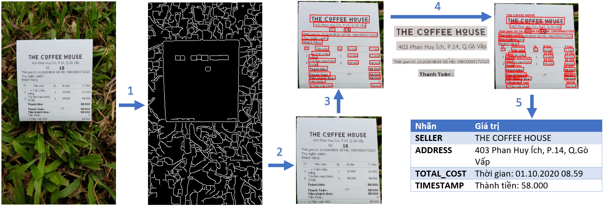

# Vietnamese Receipt Reader 

## Pipeline
1. Use Canny Edge Detector and then detect contours to extract receipt from the image.
2. Use Pixel Agreation Network (PAN) to detect text regions from extracted receipt, then crop these regions.
3. Use VietOCR to extract texts from regions.
4. Retrieve information

## Datasets
- [MCOCR-2020](https://drive.google.com/file/d/1cyEGMVcEkquduJp3ewGq9Q4SyliX0bfB/view?usp=sharing)
- [SROIE19](https://drive.google.com/drive/folders/1jdFA0yg8uw15scux8O73qs6c5fr1cUff?usp=sharing)

## Pretrained
- Pretrained PAN weights on SROIE19: [link](https://drive.google.com/file/d/1NIIGWdGdCD9c2TPqyPoiRao2tR69BXgN/view?usp=sharing)
- Pretrained OCR weights on MCOCR2021: [link](https://drive.google.com/drive/folders/1JgCVtxA8hfUl1E4JqS3moPB_7b8lhL0w?usp=sharing)

## Inference
- Install dependencies
```pip install -r requirements.txt```

- Download pretrained model above
- Scan receipt in image:
```
cd preprocess
python scan.py --image=<path to image> --output=<output folder>
```

- Detect texts and crop regions from extracted image above:
```
cd detection
python predict.py -i=<input filename> -o=<output folder> -w=<model's checkpoint>
```

- Extract text from text regions above:
```
cd ocr
python predict.py -i=<input folder> -o=<output txt> -w=<ocr model's checkpoint> -c=<ocr model's config>
```

- Full pipeline:
```
python run.py --input=<input image> --output=<output folder>
```

## References
- https://github.com/WenmuZhou/PAN.pytorch
- https://github.com/andrewdcampbell/OpenCV-Document-Scanner
- https://github.com/pbcquoc/vietocr

## Pipeline

